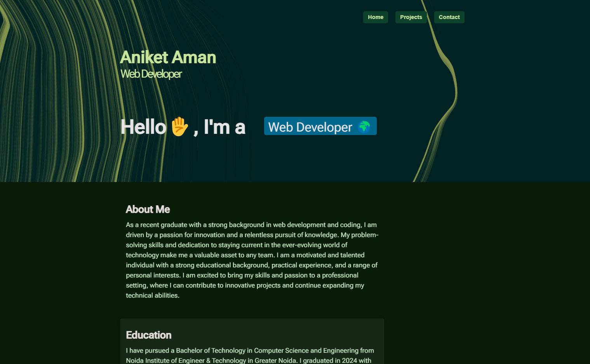
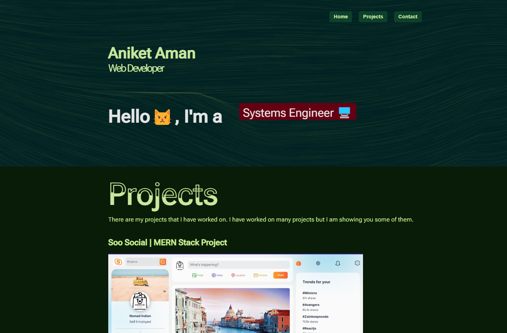
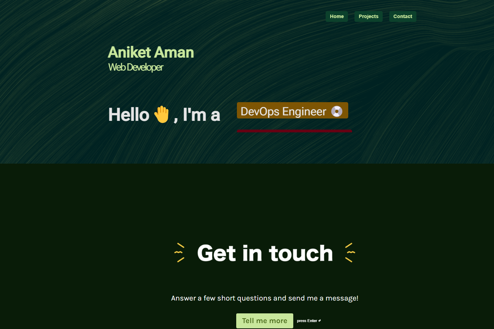

# Simple Portfolio
[](https://opensource.org/licenses/)

A simple and minimal multi-page portfolio page with homepage, projects and a contact page.


## Screenshots






## Run Locally

Clone the project

```bash
  git clone https://github.com/tushgaurav/developer-portfolio
```

Go to the project directory

```bash
  cd developer-portfolio
```

Install dependencies

```bash
  npm install
```

Start the server

```bash
  npm run start
```

